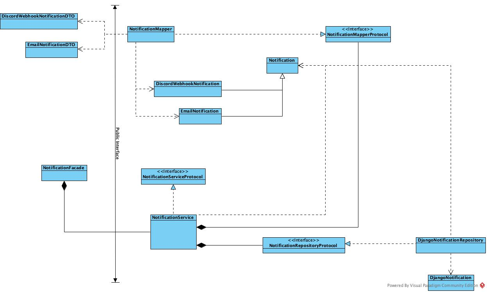

# Django Simple Notifications
Send notifications straight from the code using various mediums.

Features:
1. Simple interface
2. Notification history with django admin

## How to use?

### Discord Webhook
* Create discord channel webhook
[Tutorial](https://support.discord.com/hc/en-us/articles/228383668-Intro-to-Webhooks)
* Use it

```python
from django_simple_notifications.dto import SlackWebhookNotificationDTO
from django_simple_notifications.facades import NotificationFacade

notification_facade = NotificationFacade()
slack_webhook_notification = SlackWebhookNotificationDTO(
    text='Test Message',
    webhook='https://hooks.slack.com/services/XXXXXX',
)

notification_facade.send_notification(notification_dto=slack_webhook_notification)
```

### Slack Webhook
* Create slack channel webhook
[Tutorial](https://api.slack.com/messaging/webhooks)
* Use it
```python
from django_simple_notifications.dto import DiscordWebhookNotificationDTO
from django_simple_notifications.facades import NotificationFacade

notification_facade = NotificationFacade()
discord_webhook_notification = DiscordWebhookNotificationDTO(
    subject='test',
    body='test',
    webhook='https://discord.com/api/webhooks/XXXXXX',
)

notification_facade.send_notification(notification_dto=discord_webhook_notification)
```
## Class diagram overview

